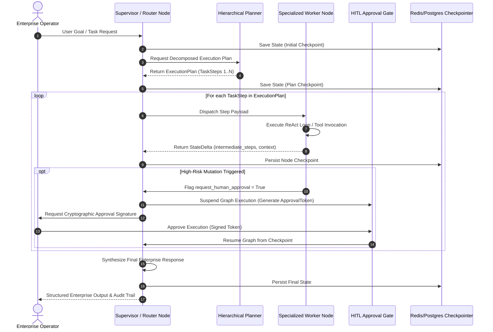

# 🧠 01. Stateful Multi-Agent StateGraph Architecture

[](#)
[](#)
[](#)
[](#)

---

## 🏛️ Architectural Overview

In enterprise deployments, non-deterministic single-prompt agent loops fail under production SLAs due to context drift, unbounded loops, and lack of rollback capabilities. 

This architecture implements a **Stateful LangGraph StateGraph Pattern** with:
1. **Strongly-Typed State Channels:** Pydantic-enforced state boundaries ensuring memory monotonicity across node transitions.
2. **Deterministic Supervisor Routing:** Context-aware routing evaluating agent confidence, task dependencies, and policy constraints.
3. **Resilient Checkpointing:** Serializable snapshots persisted to PostgreSQL/Redis after every node execution for fault-recovery and time-travel debugging.
4. **Zero-Trust Human-in-the-Loop (HITL) Gates:** Asynchronous pause/resume mechanics for high-risk write operations (e.g., cloud resource mutation, financial transactions, database writes).

---

## 📐 System Sequence Diagram



---

## 📂 Blueprint Files

* [`state_graph_blueprint.py`](./state_graph_blueprint.py): Complete, executable Pydantic V2 state schema, reducer functions, checkpointing interface, and routing simulation.

### Quick Verification
```bash
python 01_agentic_patterns/state_graph_blueprint.py
```

---

## 📊 Key Architectural Specifications

| Specification | Implementation Standard | Enterprise Benefit |
| :--- | :--- | :--- |
| **State Immutability** | Pydantic V2 Deep-Copy Reducers | Prevents race conditions in parallel subgraphs |
| **Fault Recovery** | Point-in-Time Checkpointer (`StateCheckpoint`) | Eliminates state loss during container restarts |
| **Loop Protection** | Monotonic `iteration_count` ceiling | Guards against unbounded token consumption |
| **Security Control** | Cryptographic Approval Tokens (`auth_req_*`) | Enforces separation of duties for mutating actions |
