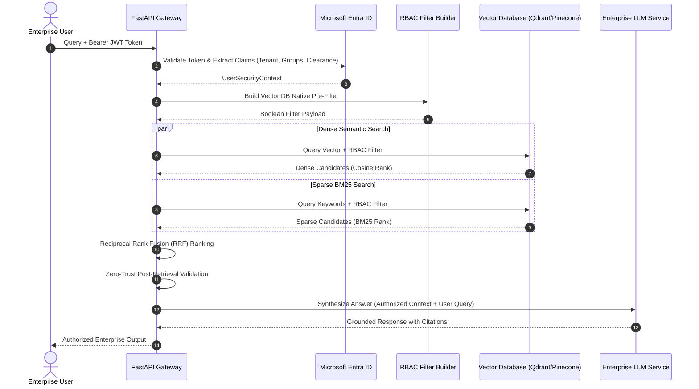

# 🛡️ 02. Identity-Aware Entra ID RBAC Vector Retrieval

[](#)
[-0078D4.svg)](#)
[](#)
[-green.svg)](#)

---

## 🏛️ Architectural Overview

Standard Retrieval-Augmented Generation (RAG) pipelines ingest enterprise documents indiscriminately and query vector databases without user context. This creates critical **data leakage vulnerabilities** (OWASP LLM06 / Sensitive Information Disclosure), where lower-privileged employees retrieve confidential executive memos or HR records simply because the semantic similarity score is high.

This reference architecture implements **Identity-Aware RBAC Vector Retrieval**:
1. **Token Claims Extraction:** Validates OAuth2 JWT tokens from Microsoft Entra ID (Azure AD) to construct an immutable `UserSecurityContext` (roles, groups, security clearance).
2. **Database-Level Pre-Filtering:** Compiles user security claims into native vector DB boolean filters (e.g. Qdrant payload queries), preventing unauthorized vector distance calculations.
3. **Hybrid Search with Reciprocal Rank Fusion (RRF):** Fuses dense embeddings (semantic meaning) and sparse BM25 indices (exact keyword/ID matches) using constant $k=60$.
4. **Zero-Trust Post-Retrieval Verification:** Enforces a secondary defensive gate before injecting retrieved context into the LLM context window.

---

## 📐 System Sequence Diagram



---

## 📂 Blueprint Files

* [`rbac_rag_blueprint.py`](./rbac_rag_blueprint.py): Complete, executable Pydantic V2 schemas for security contexts, chunk ACLs, vector filter builders, and RRF algorithms.

### Quick Verification
```bash
python 02_vector_retrieval_rbac/rbac_rag_blueprint.py
```

---

## 📊 Key Architectural Specifications

| Specification | Implementation Standard | Enterprise Benefit |
| :--- | :--- | :--- |
| **Identity Source** | Microsoft Entra ID (OAuth2/OIDC) | Native enterprise SSO & group membership sync |
| **Filter Execution** | Database-level payload pre-filtering | Zero computational overhead on forbidden chunks |
| **Hybrid Ranking** | Reciprocal Rank Fusion ($k=60$) | Combines semantic nuance with exact acronym precision |
| **Security Standard** | OWASP Top 10 for LLMs (LLM06 Mitigation) | 100% data boundary isolation across tenants and roles |
