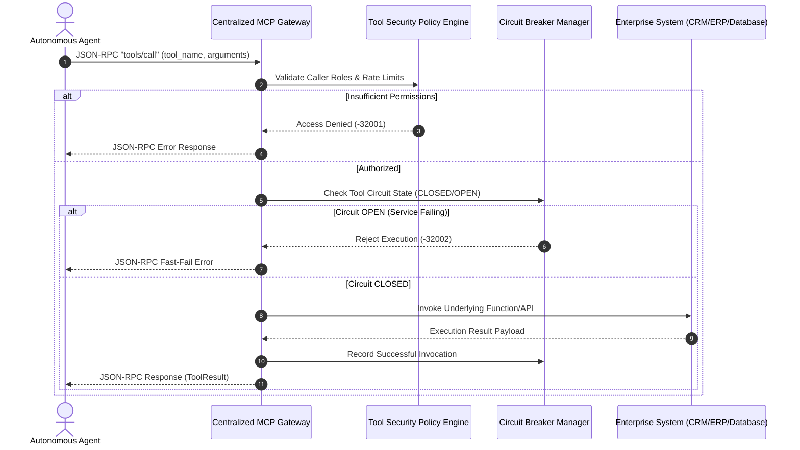

# 🔌 03. Centralized Model Context Protocol (MCP) Gateway

[](#)
[-000000.svg)](#)
[](#)
[](#)

---

## 🏛️ Architectural Overview

As enterprise multi-agent ecosystems expand, connecting agents directly to individual REST APIs, SQL databases, and SaaS platforms creates point-to-point spaghetti code, unmonitored API credential sprawl, and unmitigated risk of prompt-injection tool misuse.

This reference architecture implements a **Centralized Model Context Protocol (MCP) Gateway**:
1. **JSON-RPC 2.0 Standardization:** Exposes unified `tools/list` and `tools/call` endpoints conforming to the open Model Context Protocol specification.
2. **Fine-Grained Tool Authorization:** Validates caller security roles against tool-specific access policies before dispatching execution.
3. **Resilience & Circuit Breaking:** Automatically isolates failing downstream microservices to prevent cascade failures in long-running agent state graphs.
4. **Auditability & Observability:** Logs structured JSON-RPC payloads, execution latency, and token parameters for enterprise compliance.

---

## 📐 System Sequence Diagram



---

## 📂 Blueprint Files

* [`mcp_gateway_blueprint.py`](./mcp_gateway_blueprint.py): Complete, executable Pydantic V2 schemas for JSON-RPC 2.0 messages, Tool definitions, Security policies, Circuit breaker state machine, and Gateway dispatcher.

### Quick Verification
```bash
python 03_mcp_gateway/mcp_gateway_blueprint.py
```

---

## 📊 Key Architectural Specifications

| Specification | Implementation Standard | Enterprise Benefit |
| :--- | :--- | :--- |
| **Protocol Standard** | Anthropic Model Context Protocol (MCP) | Universal interoperability across Claude, GPT-4, and custom agents |
| **Tool Isolation** | Role-Based Execution Policies | Prevents unprivileged agents from triggering destructive actions |
| **Fault Tolerance** | Automated 3-State Circuit Breakers | Protects backend enterprise databases from agent retry storms |
| **Transport Support** | SSE (Server-Sent Events) & Standard HTTP | Seamless integration with both synchronous and streaming agents |
