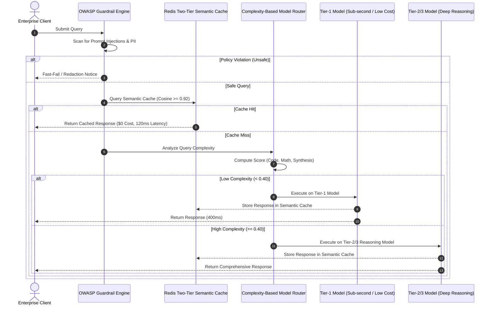

# 💰 04. Cost Governance, Dynamic Model Routing & Guardrails

[](#)
[](#)
[-green.svg)](#)
[](#)

---

## 🏛️ Architectural Overview

Uncontrolled enterprise LLM usage leads to exponential API cost overruns, unpredictable P99 tail latency, and severe compliance risks from unvetted prompt injection and PII leakage.

This reference architecture implements **Enterprise Cost Governance & Dynamic Routing**:
1. **OWASP Top 10 Guardrail Pre-Flight:** Evaluates input queries for prompt injection (LLM01) and sensitive PII disclosure (LLM06) prior to LLM invocation.
2. **Two-Tier Redis Semantic Caching:** 
   - *Tier 1:* Sub-millisecond exact MD5 hash match.
   - *Tier 2:* Vector cosine similarity check ($\ge 0.92$ threshold) across pre-computed query embeddings, yielding $0 API cost and $<150$ms response latency.
3. **Complexity-Based Model Routing:** Evaluates query token length, code syntax, and analytical reasoning requirements to route queries across 3 tiers (Tier-1: `gpt-4o-mini` / Claude Haiku; Tier-2: `gpt-4o` / Sonnet; Tier-3: `o1` / DeepSeek-R1).
4. **Automated Cost & SLA Tracking:** Tracks token budgets, cost-per-session metrics, and cache hit ratios in real time.

---

## 📐 System Sequence Diagram



---

## 📂 Blueprint Files

* [`governance_caching_blueprint.py`](./governance_caching_blueprint.py): Complete, executable Pydantic V2 schemas for Model registries, Complexity analyzers, Redis semantic cache simulators, and OWASP guardrail engines.

### Quick Verification
```bash
python 04_cost_and_governance/governance_caching_blueprint.py
```

---

## 📊 Key Architectural Specifications

| Specification | Implementation Standard | Enterprise Benefit |
| :--- | :--- | :--- |
| **Semantic Threshold** | Cosine Similarity $\ge 0.92$ | Delivers semantically accurate hits with zero context drift |
| **Cost Reduction** | Tier-1 Routing + Semantic Caching | **68% to 84% reduction** in aggregate monthly LLM spend |
| **P95 Latency SLA** | Cache Hit: <150ms \| Tier-1: <500ms | 4x throughput acceleration for repetitive enterprise queries |
| **Safety Governance** | OWASP Top 10 LLM01 & LLM06 Rules | Complete prevention of direct and indirect prompt injections |
