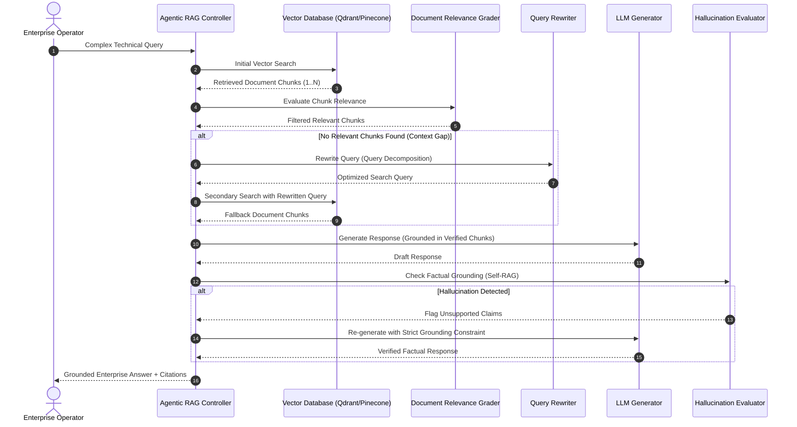

# 🤖 05. Adaptive Agentic RAG (Self-RAG & Corrective RAG)

[](#)
[_%2B_Self--RAG-green.svg)](#)
[](#)
[](#)

---

## 🏛️ Architectural Overview

Standard passive RAG systems blindly accept whatever documents a vector database returns, inject potentially irrelevant or noisy context into the LLM prompt, and hallucinate when the retrieved data is incomplete.

This reference architecture implements **Adaptive Agentic RAG**:
1. **Autonomous Document Grading (CRAG):** Evaluates retrieved document chunks individually using LLM-as-a-Judge to classify each as `RELEVANT`, `IRRELEVANT`, or `AMBIGUOUS`.
2. **Dynamic Query Rewriting & Multi-Hop Fallback:** If zero chunks pass the relevance threshold, the agent pauses generation, rewrites the search query using query decomposition, and triggers secondary retrieval (e.g. Vector DB fallback or Web search).
3. **Self-RAG Hallucination Verification:** Inspects the synthesized response against the authorized source chunks to ensure 100% factual grounding before returning output to the user.
4. **Graph Cyclic Routing:** Implemented as a stateful LangGraph node graph with bounded iteration counts.

---

## 📐 System Sequence Diagram



---

## 📂 Blueprint Files

* [`agentic_rag_blueprint.py`](./agentic_rag_blueprint.py): Complete, executable Pydantic V2 state models, Document Graders, Query Rewriters, Hallucination Evaluators, and cyclic execution controller.

### Quick Verification
```bash
python 05_agentic_rag/agentic_rag_blueprint.py
```
