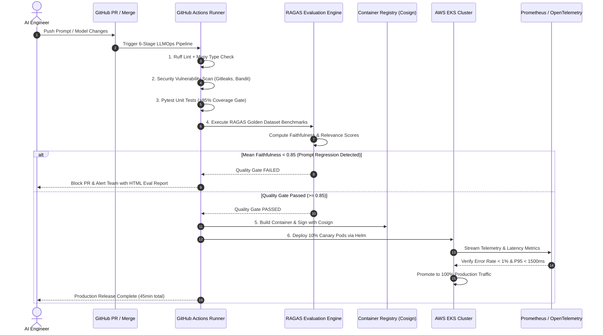

# 🚀 06. 6-Stage LLMOps CI/CD Pipeline & Automated RAGAS Evaluation

[](#)
[](#)
[](#)
[](#)

---

## 🏛️ Architectural Overview

Deploying GenAI applications without automated evaluation gates frequently leads to catastrophic **prompt regressions**, where an unvetted prompt edit or fine-tuned model checkpoint passes unit tests but causes severe factual hallucinations in production.

This reference architecture implements an **Enterprise 6-Stage LLMOps Pipeline with Automated RAGAS Quality Gates**:
1. **Stage 1 (Lint & Static Analysis):** Ruff, Black, Mypy type-checking, Pydantic V2 schema validation.
2. **Stage 2 (Security & Secret Scan):** Bandit, CodeQL, Gitleaks, OWASP LLM vulnerability audits.
3. **Stage 3 (Unit & StateGraph Tests):** Pytest suite covering state reducers, checkpointing, and tool dispatchers (>85% code coverage).
4. **Stage 4 (RAGAS Evaluation Gate):** Automated LLM-as-a-Judge benchmarking across Golden Datasets requiring **Faithfulness $\ge 0.85$** and **Answer Relevance $\ge 0.85$** to unblock deployment.
5. **Stage 5 (Container Hardening & Cosign Signing):** Distroless Docker build with cryptographic image signing.
6. **Stage 6 (Canary Deployment on AWS EKS):** Helm-managed canary release with Prometheus metric-driven automated rollback on `error_rate > 1%`.

---

## 📐 System Sequence Diagram



---

## 📂 Blueprint Files

* [`ragas_eval_pipeline_blueprint.py`](./ragas_eval_pipeline_blueprint.py): Complete, executable Pydantic V2 schemas for Golden datasets, RAGAS score calculators, Quality gate threshold evaluators, and pipeline reporters.

### Quick Verification
```bash
python 06_llmops_ragas_eval/ragas_eval_pipeline_blueprint.py
```
