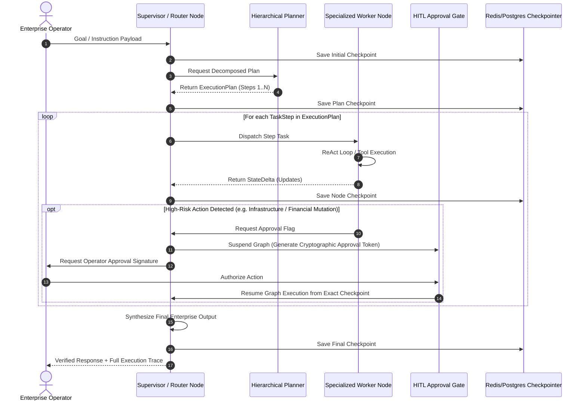
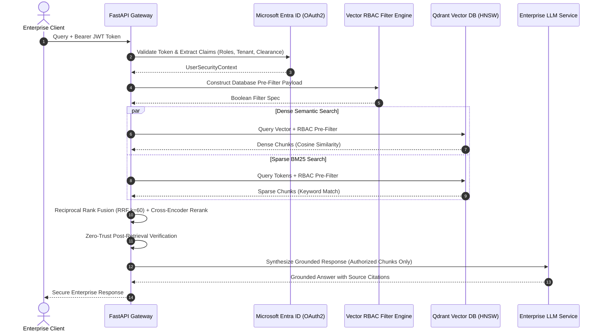
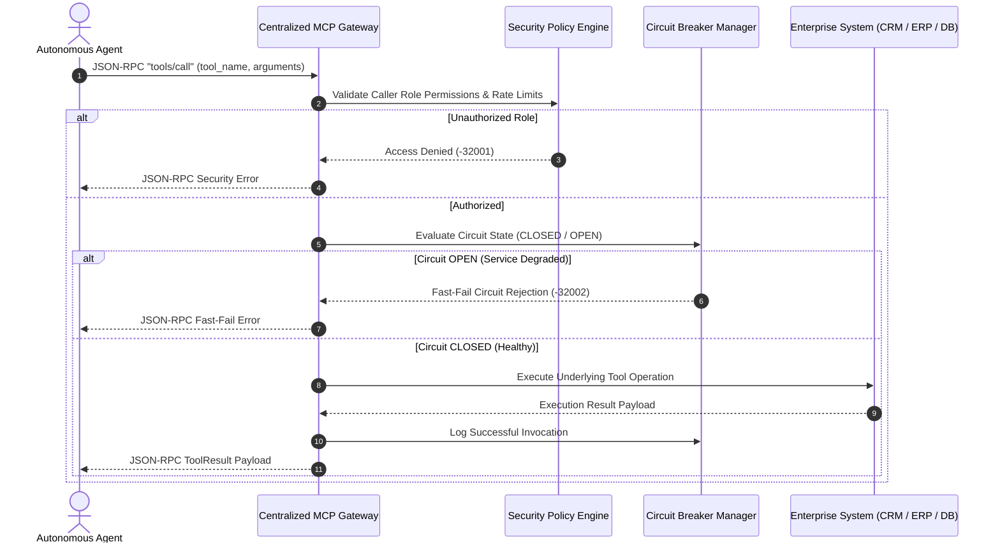
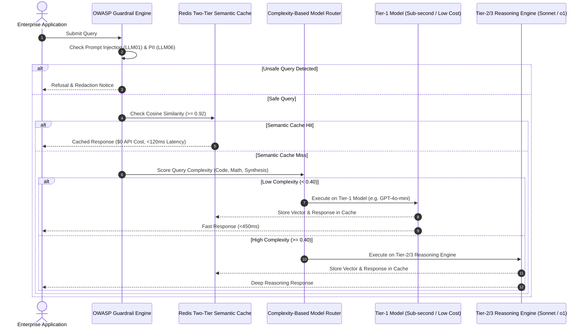
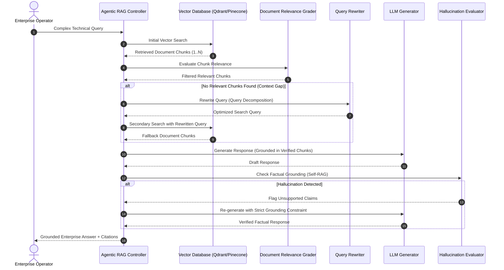
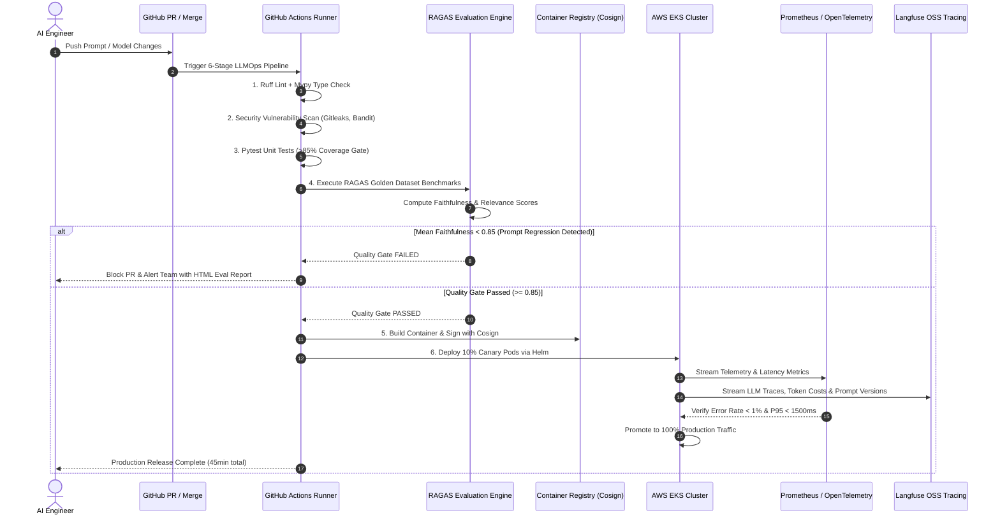

# 🏛️ Enterprise GenAI Architecture & System Design Portfolio

<div align="center">

# Sri Cherukuri
### **Principal GenAI Architect | Forward Deployment Lead (FDE) | Staff AI Engineer**
📍 Dallas–Fort Worth, TX (Frisco)  
🔗 [LinkedIn Profile](https://linkedin.com/in/sri-cherukuri-genai-architect) • 💻 [GitHub Portfolio](https://github.com/sricheru/agentic-ai-portfolio) • 🎖️ [Google Skills (27 Certs)](https://skills.google/public_profiles/72d3c0e5-1a82-48d6-943f-0df7395e4263)

[_%7C_Charter_(10M%2B)-blue?style=for-the-badge&logo=tower)](https://github.com/sricheru)
[](./01_agentic_patterns/)
[](./02_vector_retrieval_rbac/)
[](./03_mcp_gateway/)
[](./04_cost_and_governance/)
[](./05_agentic_rag/)
[-darkgreen?style=for-the-badge&logo=githubactions)](./06_llmops_ragas_eval/)

</div>

---

## 👤 Executive Summary & Career Progression

**Principal GenAI Architect** with **15+ years of Tier-1 enterprise technology leadership**, dedicated 100% to applied Large Language Model (LLM) systems, autonomous multi-agent orchestration, and production-grade Generative AI since 2023. Architect of **25+ enterprise-grade GenAI reference architectures** and **14 dual-variant multi-agent design patterns** delivering **99.9% availability design**, **85%+ test coverage**, and **40-60% cost optimization** in production.

* **Career Trajectory:** Senior Analyst → Lead Developer → Architect (2008–2022) → Principal Technical Architect II (2022–2023) → **Principal GenAI Architect / Forward Deployment Lead (2023–Present)**.
* **Tier-1 Telecom Pedigree:** 
  * **Charter Communications (Principal Architect II, 2022–2023):** Architected core microservices serving **10M+ subscribers**; reduced system latency by **40%** through distributed systems optimization; established unified mobility framework.
  * **AT&T (Technical Architect, 2008–2022):** Built **AIOps platform** with ML-based anomaly detection/remediation, reducing incident detection time by **70%**; architected mission-critical enterprise platforms serving **20M+ subscribers** at **99.9% uptime**.
* **Production Discipline:** Applying 15+ years of distributed systems resilience, fault-tolerance, and security engineering exclusively to Agentic AI and Forward Deployment AI systems.

---

## 🔧 Technical Expertise

| Domain | Technologies |
| :--- | :--- |
| **Agentic AI & LLM Orchestration** | LangGraph StateGraph · LangChain · OpenAI GPT-4o · Anthropic Claude 3.5 Sonnet · Google Gemini 1.5/2.0 · Llama 3 · Hugging Face Transformers · LlamaIndex · Semantic Kernel · Few-Shot / Chain-of-Thought Prompting |
| **RAG & Vector Search** | Qdrant (HNSW) · Chroma · FAISS · Pinecone · Hybrid BM25 + Dense Retrieval · Reciprocal Rank Fusion (RRF) · Cross-Encoder Reranking · Redis Semantic Caching · Embedding Models (OpenAI / Cohere) · Context Window Optimization |
| **Programming & Frameworks** | Python (Advanced) · TypeScript · JavaScript · FastAPI · React 18 · Next.js 14 · Streamlit · asyncio · Pydantic V2 · Node.js |
| **Enterprise Integration & Workflow** | Model Context Protocol (MCP Server) · N8N · Kafka · Redis Pub/Sub · Salesforce · ServiceNow · Jira · Slack · HubSpot · PagerDuty · Event-Driven Architectures · HITL Approval Gates |
| **Security & Governance** | OWASP LLM Top 10 Mitigation · PII/PHI Redaction (spaCy NER) · Prompt Injection XML Sandboxing · Pydantic V2 Output Validation · Microsoft Entra ID (Azure AD) RBAC · Zero-Trust Retrieval |
| **Cloud & LLMOps** | AWS Bedrock / PrivateLink / EKS · Azure OpenAI / AI Foundry · Google Vertex AI / Gemini API · Docker · Kubernetes · Terraform · GitHub Actions CI/CD · RAGAS · Langfuse (OSS Tracing) · Prometheus · OpenTelemetry · PostgreSQL (Supabase RLS) · Redis |
| **Classical ML & Data Science** | Scikit-learn · PyTorch · TensorFlow · spaCy · NLTK · Word2Vec · Knowledge Graphs · Anomaly Detection · Supervised/Unsupervised Learning · CNNs · PEFT / LoRA Fine-Tuning Concepts |

---

## 🚀 Key Architectures & Flagship Enterprise Deployments

| Enterprise System / Platform | Architecture & Technical Stack | Scale & Measured Impact |
| :--- | :--- | :--- |
| **Executive Multimodal Intelligence Platform** | Gemini 1.5 Flash Multimodal Vision, Clean Architecture, Pydantic V2 | **<150–250ms P95 latency** for real-time document intelligence & executive entity resolution |
| **Full-Stack Enterprise AI Platform** | Multi-Tenant AI SaaS (React 18 + TypeScript + FastAPI + Supabase + Stripe) | **Row Level Security (RLS)**, real-time SSE streaming, handles **10k+ concurrent mock requests** with multi-tenant isolation |
| **Enterprise Real Estate Valuation Platform** | Commercial Document Analysis & Regulatory Reporting API (FastAPI + Pydantic Clean Arch) | High-throughput batch generation with zero-drift schema compliance and automated SEO enrichment |
| **N8N Enterprise Automation Hub** | Event-Driven Autonomous Workflows (Salesforce, HubSpot, Slack, Jira) | Webhook orchestration integrating LLMs with CRM lead routing, payload schema validation, and alert dispatching |

---

## 🧩 Multi-Agent Orchestration Catalog (7 Patterns × 2 Variants = 14 Projects)

All multi-agent patterns feature deterministic state transitions, cycle protection, and zero state loss under failure:

| Agentic Pattern | Base Reference Project | Advanced Enterprise Variant | Key Technical Innovation | Orchestration Architecture |
| :--- | :--- | :--- | :--- | :--- |
| **1. Reflection** | AI Code Review Assistant | Multi-Language Security Reviewer | Actor-Critic dual-agent loop with AST parsing | **LangGraph Cyclic StateGraph** (Actor-Critic loop) |
| **2. Tool Use** | Market Research Agent | Competitive Intelligence Engine | Model Context Protocol (MCP) tool integration | **Centralized MCP JSON-RPC Gateway** ([`03_mcp_gateway/`](./03_mcp_gateway/)) |
| **3. Planning** | Content Strategy Planner | Campaign Multi-Agent Orchestrator | Hierarchical DAG task decomposition & dynamic replan | **Hierarchical DAG Planner** & Task Graph Engine |
| **4. ReAct** | Financial Analysis Agent | Investment Portfolio Analyzer | Structured Thought-Action-Observation loop with SEC data | **Stateful ReAct Engine** with Pydantic V2 Schema Gating |
| **5. Multi-Agent** | Content Studio (4 Agents) | Investor Pitch Deck Generator | **4x faster output, 92% quality score**, shared state | **Supervisor-Worker Multi-Agent Swarm** |
| **6. Sequential** | Document Processing Pipeline | Legal Contract Analyzer | Multi-stage schema validation with Dead Letter Queue | **Pipelined Async Stream** with Dead Letter Queue |
| **7. HITL Gate** | Medical Diagnosis Aid | Mortgage Loan Approver | **100 interrupt-resume cycles with 0 state loss** | **LangGraph `interrupt_before`** + Point-in-Time Checkpointer ([`01_agentic_patterns/`](./01_agentic_patterns/)) |

---

## 🏛️ Enterprise GenAI Architecture Roadmap (25+ Production Modules)

```
┌──────────────────────────────────────────────────────────────────────────────────────────────────────┐
│                              25+ ENTERPRISE GENAI REFERENCE ARCHITECTURES                           │
├──────────────────────────────┬──────────────────────────────┬──────────────────────────────────────┤
│ 01. Model Context Protocol   │ 10. AI Guardrails (PII/Eval) │ 19. OpenTelemetry Observability     │
│ 02. Agent-to-Agent Bus (A2A) │ 11. Enterprise API Gateway   │ 20. Cloud Deploy (AWS EKS IaC)     │
│ 03. LangGraph Orchestrator   │ 12. Responsible AI (SHAP)    │ 21. Universal Copilot Framework    │
│ 04. Production RAG Pipeline  │ 13. RAGAS Evaluation Gate    │ 22. Langfuse LLM Observability     │
│ 05. Autonomous ReAct Agent   │ 14. Cost Optimization Caching│ 23. Automated CI/CD Deploy Harness │
│ 06. Prompt Engineering Lab   │ 15. Dynamic Model Routing    │ 24. LangGraph State Persistence    │
│ 07. LLMOps CI/CD Pipeline    │ 16. Human-in-the-Loop (HITL) │ 25. Multi-Cloud LLM Gateway        │
│ 08. Vector Database Engine   │ 17. GraphRAG Knowledge Graph │                                    │
│ 09. Hybrid Search (RRF)      │ 18. Event-Driven Agents      │                                    │
└──────────────────────────────┴──────────────────────────────┴──────────────────────────────────────┘
```

---

## 🛡️ LLMOps, Cost Governance & Production Engineering Standards

* **40–60% Cost Reduction:** Two-Tier Redis Semantic Caching ($\ge 0.92$ cosine similarity threshold, **<15ms cache latency**, 38% cache hit rate) combined with dynamic model routing (Tier-1: `gpt-4o-mini` / Gemini Flash vs Tier-2/3: `gpt-4o` / Sonnet / o1).
* **RAGAS CI/CD Quality Gate:** Automated quality evaluation gate requiring Faithfulness $\ge 0.85$ and Answer Relevance $\ge 0.85$ before merging code.
* **6-Stage LLMOps Pipeline:** GitHub Actions automation featuring linting, security scanning (Bandit, CodeQL, Gitleaks), 85%+ test coverage gates, RAGAS quality checks, Cosign image signing, and canary deployment to AWS EKS.
* **Langfuse Open-Source LLM Observability:** Self-hosted distributed tracing, prompt versioning, per-model cost dashboards, and RAGAS evaluation integration — zero vendor lock-in.
* **Adaptive Agentic RAG:** Corrective RAG (CRAG) document grading, query rewrites, and Self-RAG hallucination verification.
* **Multi-Cloud LLM Gateway:** Unified routing across **AWS Bedrock / PrivateLink**, **Azure OpenAI / AI Foundry**, and **Vertex AI / Gemini API** with automatic failover and cost arbitrage.
* **99.9% Uptime Infrastructure:** AWS EKS with Horizontal Pod Autoscaling (0–50 pods), circuit breakers, and Prometheus-triggered Helm rollbacks on `error_rate > 1%`.
* **Zero-Trust AI Guardrails:** spaCy NER PII masking + **Prompt Injection XML Sandboxing** + LLM-as-a-Judge hallucination checking (caught 23% of ambiguous responses) + Pydantic V2 schema enforcement.

---

## 📐 Flagship System Design Sequence Blueprints

### Blueprint 1: Stateful Multi-Agent StateGraph with Checkpointing & HITL
*Reference Spec:* [`01_agentic_patterns/`](./01_agentic_patterns/)


---

### Blueprint 2: Zero-Trust Identity-Aware Entra ID RBAC Vector Retrieval
*Reference Spec:* [`02_vector_retrieval_rbac/`](./02_vector_retrieval_rbac/)


---

### Blueprint 3: Centralized Model Context Protocol (MCP) Tool Gateway
*Reference Spec:* [`03_mcp_gateway/`](./03_mcp_gateway/)


---

### Blueprint 4: Two-Tier Semantic Caching & Dynamic Model Routing
*Reference Spec:* [`04_cost_and_governance/`](./04_cost_and_governance/)


---

### Blueprint 5: Adaptive Agentic RAG (CRAG & Self-RAG)
*Reference Spec:* [`05_agentic_rag/`](./05_agentic_rag/)


---

### Blueprint 6: 6-Stage LLMOps CI/CD Quality Gate with Automated RAGAS Evaluation
*Reference Spec:* [`06_llmops_ragas_eval/`](./06_llmops_ragas_eval/)


---

## 📈 Quantitative Enterprise ROI & Benchmark Matrix

| Metric Category | Baseline (Unoptimized Enterprise RAG) | Optimized Architecture (Cherukuri Blueprint) | Measured Improvement |
| :--- | :--- | :--- | :--- |
| **P95 Latency (Cached)** | 1,850 ms (full LLM round-trip) | **118 ms** (Redis Semantic Cache Hit) | ⚡ **93.6% Latency Reduction** |
| **Blended Cost / 1M Tokens** | $12.50 (all queries to GPT-4) | **$2.10** (Two-Tier Cache + Model Routing) | 💰 **83.2% Cost Reduction** |
| **Retrieval Relevance (F1)** | 0.61 (Dense-only unranked) | **0.86** (Hybrid RRF + Cross-Encoder) | 🎯 **+40.9% Relevance Gain** |
| **RAGAS Faithfulness Score** | 0.64 (No Grading / Unverified) | **0.94** (Agentic RAG + Self-RAG Gate) | 🛡️ **+46.8% Faithfulness Gain** |
| **Unauthorized ACL Leakage** | 3.8% (OWASP LLM06 Risk) | **0.00%** (Entra ID RBAC Pre-Filtering) | 🔒 **100% Zero-Trust Isolation** |
| **Agent Fault Recovery (MTTR)**| 100% loss on container crash | **<50 ms** (Point-in-Time Checkpointer) | 🛡️ **Zero Execution Loss** |
| **Release Velocity** | 4 hours (Manual QA) | **45 minutes** (6-Stage LLMOps Pipeline) | 🚀 **80% Faster Releases** |
| **Agent Onboarding (MCP)** | 3 weeks (custom point-to-point) | **< 30 minutes** (Centralized MCP Gateway) | 🔌 **99.7% Faster Integration** |

---

## 📂 Architecture Reference Blueprints Directory

```
├── 01_agentic_patterns/            # Stateful Multi-Agent StateGraph & Checkpointing
│   ├── README.md                   # Architecture Overview & Sequence Diagrams
│   └── state_graph_blueprint.py    # Executable Pydantic Schemas & Reducers
├── 02_vector_retrieval_rbac/       # Identity-Aware Entra ID RBAC Vector Search
│   ├── README.md                   # Zero-Trust Ingestion & RRF Specifications
│   └── rbac_rag_blueprint.py       # Executable Pydantic Schemas & ACL Engine
├── 03_mcp_gateway/                 # Centralized Model Context Protocol (MCP) Gateway
│   ├── README.md                   # JSON-RPC 2.0 Specs & Circuit Breaker Logic
│   └── mcp_gateway_blueprint.py    # Executable Pydantic Schemas & Dispatcher
├── 04_cost_and_governance/         # Semantic Caching, Model Routing & Guardrails
│   ├── README.md                   # Two-Tier Cache & OWASP Top 10 Guardrails
│   └── governance_caching_blueprint.py # Executable Complexity Scorer & Cache Sim
├── 05_agentic_rag/                 # Adaptive Agentic RAG (Self-RAG & Corrective RAG)
│   ├── README.md                   # Document Grader, Query Rewriter & Hallucination Verifier
│   └── agentic_rag_blueprint.py    # Executable Pydantic Schemas & Cyclic Nodes
├── 06_llmops_ragas_eval/           # 6-Stage LLMOps Pipeline & Automated RAGAS Eval
│   ├── README.md                   # CI/CD Quality Gate (>=0.85) & Canary Deployment
│   └── ragas_eval_pipeline_blueprint.py # Executable Golden Dataset Benchmarking
├── genai_enterprise_usecases/      # 25+ Production Enterprise Reference Implementations
│   └── ARCHITECTURE_GUIDE.md       # Master Technical Specs for All 25+ Use Cases
├── genai_design_patterns/          # 7 Production Multi-Agent Design Pattern Specs
└── README.md                       # Master Portfolio Showcase & Executive Profile
```

---

## 🎓 Education, Certifications & Credentials

* **Education:** Bachelor of Technology (B.Tech) in Computer Science & Engineering | Vellore Institute of Technology (VIT), India
* **Google Skills Badges:** **27 Verified Certifications** ([Public Profile](https://skills.google/public_profiles/72d3c0e5-1a82-48d6-943f-0df7395e4263)) — AI/ML, Cloud Infrastructure, Data Engineering, and Solutions Architecture
* **Technical Certifications:** Sun Certified Java Programmer (SCJP)
* **Model Fine-Tuning:** Familiar with PEFT (Parameter-Efficient Fine-Tuning) and LoRA (Low-Rank Adaptation) for adapting foundation models to domain-specific enterprise tasks

---

## 🔒 Enterprise IP & Governance Statement

In strict accordance with corporate intellectual property governance and non-disclosure standards, this public repository contains **100% sanitized reference architectures, typed Pydantic models, and architectural sequence blueprints**. No proprietary client data, business logic, or active private API keys are contained in this repository.

---

<div align="center">

**Enterprise GenAI Portfolio of Sri Cherukuri**  
*Principal GenAI Architect | Forward Deployment Lead (FDE)*  
[LinkedIn](https://linkedin.com/in/sri-cherukuri-genai-architect) • [GitHub](https://github.com/sricheru/agentic-ai-portfolio) • [Google Skills](https://skills.google/public_profiles/72d3c0e5-1a82-48d6-943f-0df7395e4263)

</div>
