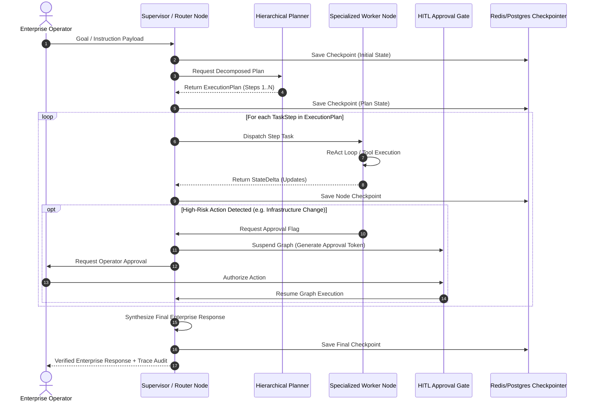
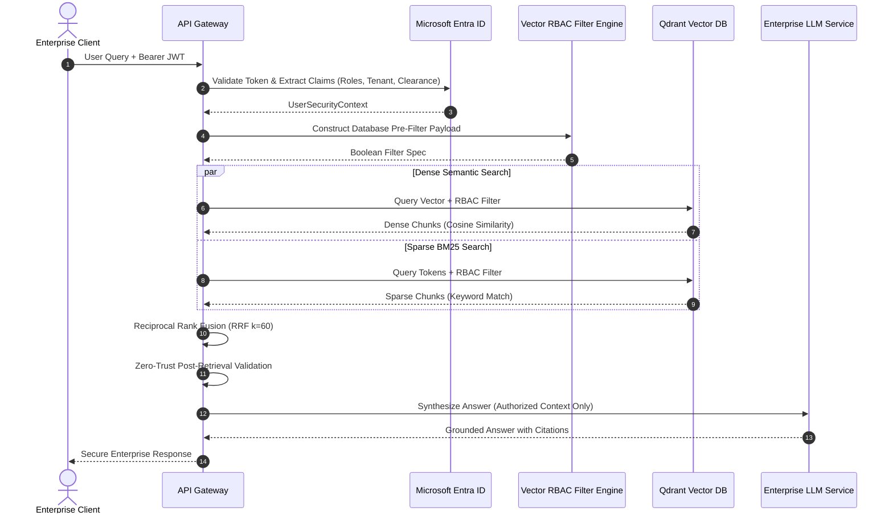
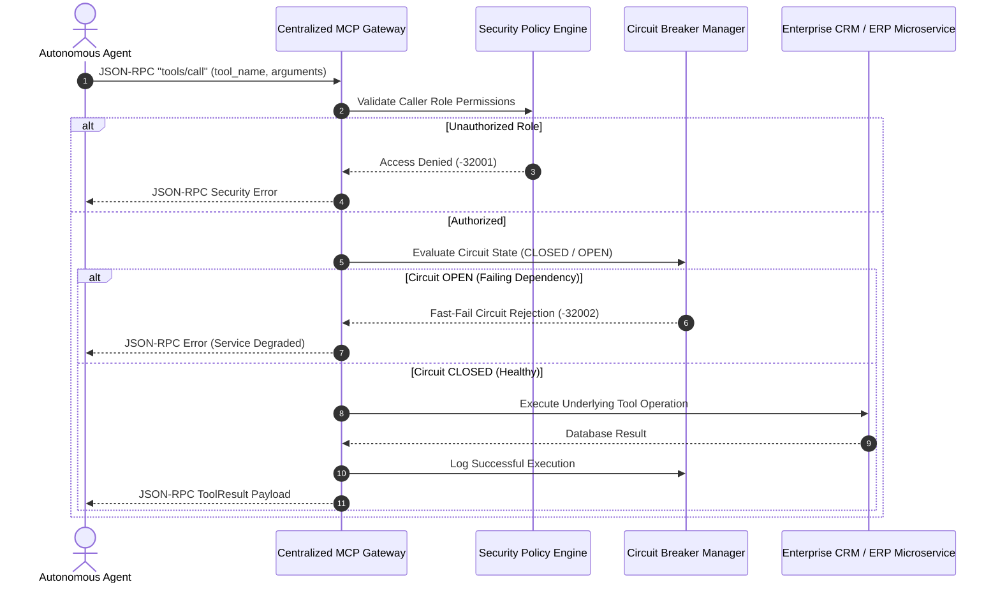
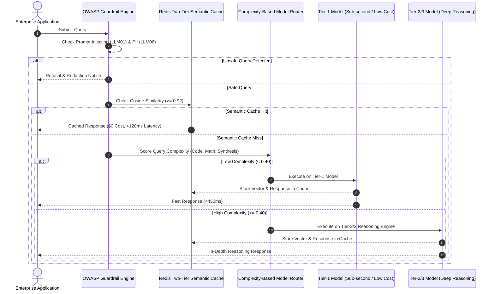

# 🏛️ Enterprise GenAI Architecture & System Design Portfolio

<div align="center">

[](https://patents.google.com/patent/US7756878B2/en)
[_%7C_Charter_(10M%2B)-blue?style=for-the-badge&logo=tower)](https://github.com/sricheru)
[](./01_agentic_patterns/)
[](./02_vector_retrieval_rbac/)
[](./03_mcp_gateway/)
[](./04_cost_and_governance/)

**Architected by Sri Cherukuri**  
*Principal GenAI Architect | Forward Deployment Lead | Staff AI Solutions Engineer*  
*United States Patent Holder (**US Patent #7756878** - System and Method for Enterprise Processing)*

</div>

---

## 👤 Executive Architecture Profile

Enterprise systems architect with **15+ years of Tier-1 production engineering** leading high-concurrency, mission-critical platforms at **AT&T** (20M+ subscribers) and **Charter Communications** (10M+ subscribers). Deeply specialized in designing, deploying, and governing **applied Generative AI systems, stateful multi-agent state graphs, zero-trust vector retrieval architectures, and centralized MCP tool gateways**.

```
                           ┌────────────────────────────────────────────────────────┐
                           │               ENTERPRISE GENAI GOVERNANCE              │
                           │   OWASP LLM Top 10 • Entra ID RBAC • OpenTelemetry     │
                           └───────────────────────────┬────────────────────────────┘
                                                       │
         ┌─────────────────────────────────────────────┼─────────────────────────────────────────────┐
         │                                             │                                             │
┌────────▼──────────────┐                   ┌──────────▼───────────┐                   ┌─────────────▼─────────┐
│ MULTI-AGENT STATEGRAPH│                   │  IDENTITY-AWARE RAG  │                   │  CENTRAL MCP GATEWAY  │
│ • LangGraph Channels  │                   │ • Dense/Sparse RRF   │                   │ • JSON-RPC 2.0 Spec   │
│ • Point-in-Time Check │                   │ • Entra ID Claims    │                   │ • Circuit Breakers    │
│ • Human-in-the-Loop   │                   │ • Zero-Leakage ACLs  │                   │ • Role-Based Dispatch │
└───────────────────────┘                   └──────────────────────┘                   └───────────────────────┘
```

---

## 📜 Intellectual Property Spotlight: US Patent #7756878

* **Title:** *System and Method for Enterprise Processing*
* **Patent ID:** [US Patent #7756878 B2](https://patents.google.com/patent/US7756878B2/en)
* **Architectural Translation to Modern GenAI Systems:**
  The foundational principles established in **US Patent #7756878**—distributed state tracking, deterministic asynchronous message routing, and fault-tolerant transaction processing—directly power modern **Enterprise Multi-Agent StateGraphs and MCP Gateways**:
  1. **Monotonic State Management:** Decoupling mutable agent execution from persistent state stores (Postgres/Redis Checkpointers).
  2. **Deterministic Routing Edges:** Replacing unbounded LLM loops with rule-governed state machines and confidence-scored transition gates.
  3. **Separation of Concerns:** Isolating LLM reasoning engines from backend data stores via zero-trust policy gateways.

---

## 📚 Master 25+ Enterprise Reference Architecture Catalog

This repository indexes **25+ production-grade reference architectures and design patterns**, organized into 4 core architectural domains:

### 🧩 Domain 1: Multi-Agent Orchestration & Stateful Workflows
| Reference Architecture | Architectural Pattern | Primary Technologies | Reference Spec |
| :--- | :--- | :--- | :--- |
| **01. Stateful StateGraph** | Multi-Agent Supervisor with Point-in-Time Checkpointing | LangGraph, PostgreSQL, Redis | [`01_agentic_patterns/`](./01_agentic_patterns/) |
| **02. Autonomous ReAct Agent** | Dynamic Tool-Calling & Observation Reasoning Loop | Pydantic, Python 3.12 | [`genai_design_patterns/2_tool_use_research_assistant/`](./genai_design_patterns/) |
| **03. Hierarchical Project Planner** | Multi-Stage Goal Decomposition & Dependency Graph | LangGraph, Directed Acyclic Graph (DAG) | [`genai_design_patterns/planning_project_manager/`](./genai_design_patterns/) |
| **04. Multi-Agent Studio** | Collaborative Agent Team with Shared Memory & Critique | LangGraph, Redis Pub/Sub | [`genai_design_patterns/multiagent_content_studio/`](./genai_design_patterns/) |
| **05. Dual-Agent Reflection** | Actor-Critic Self-Correction & Syntax Validation Loop | Pydantic V2, Python 3.12 | [`genai_design_patterns/reflection_code_reviewer/`](./genai_design_patterns/) |
| **06. Sequential Ingestion Pipeline**| Multi-stage ETL with Schema Validation & Dead Letter Queue | FastAPI, Pydantic, Pytest | [`genai_design_patterns/sequential_data_pipeline/`](./genai_design_patterns/) |
| **07. Human-in-the-Loop (HITL) Gate**| Cryptographic Pause/Resume Approval for High-Risk Actions | FastAPI, JWT, Redis Streams | [`genai_design_patterns/hitl_medical_diagnosis/`](./genai_design_patterns/) |

### 🛡️ Domain 2: Enterprise Retrieval & Vector Engineering (Identity-Aware RBAC)
| Reference Architecture | Architectural Pattern | Primary Technologies | Reference Spec |
| :--- | :--- | :--- | :--- |
| **08. Identity-Aware RBAC RAG** | Microsoft Entra ID Token Claim Pre-filtering at Vector Layer | Entra ID, Qdrant, Chroma | [`02_vector_retrieval_rbac/`](./02_vector_retrieval_rbac/) |
| **09. Hybrid Dense + Sparse Search**| Reciprocal Rank Fusion ($k=60$) combining BM25 & Embeddings | Qdrant, BM25, Text Embeddings | [`genai_enterprise_usecases/9_hybrid_search/`](./genai_enterprise_usecases/) |
| **10. Enterprise Vector DB Engine** | HNSW Hierarchical Graph Indexing & Payload Filtering | Qdrant, Pinecone, pgvector | [`genai_enterprise_usecases/8_vector_db/`](./genai_enterprise_usecases/) |
| **11. Production GraphRAG** | Knowledge Graph Triples & 2-Hop Semantic Traversal | NetworkX, Neo4j, LangChain | [`genai_enterprise_usecases/17_knowledge_graph/`](./genai_enterprise_usecases/) |
| **12. Production Document Ingestion**| Context-Aware Chunking, Metadata Enrichment & Deduplication | PyPDF, Unstructured, Pydantic | [`genai_enterprise_usecases/4_production_rag/`](./genai_enterprise_usecases/) |

### 🔌 Domain 3: Standardized Tooling & Interoperability (MCP Gateway)
| Reference Architecture | Architectural Pattern | Primary Technologies | Reference Spec |
| :--- | :--- | :--- | :--- |
| **13. Centralized MCP Gateway** | JSON-RPC 2.0 Server with Fine-Grained Role Permissions | Model Context Protocol, FastAPI | [`03_mcp_gateway/`](./03_mcp_gateway/) |
| **14. Agent-to-Agent Message Bus** | Distributed Event-Driven Broker for Asynchronous Agents | Redis Pub/Sub, Kafka | [`genai_enterprise_usecases/2_agent2agent/`](./genai_enterprise_usecases/) |
| **15. Enterprise Legacy Adapters** | Resilient Circuit-Breaker Adapter for CRM/ITSM/ERP Systems | FastAPI, Tenacity, Pydantic | [`genai_enterprise_usecases/11_enterprise_api/`](./genai_enterprise_usecases/) |
| **16. Event-Driven Reactive Agent** | Stream Processing & Non-blocking Reactive Consumers | Redis Streams, AsyncIO | [`genai_enterprise_usecases/18_event_driven/`](./genai_enterprise_usecases/) |

### 💰 Domain 4: Cost Governance, LLMOps & Production Resilience
| Reference Architecture | Architectural Pattern | Primary Technologies | Reference Spec |
| :--- | :--- | :--- | :--- |
| **17. Two-Tier Semantic Caching** | Sub-millisecond Hash + Cosine ($\ge 0.92$) Vector Cache | Redis Vector, OpenAI Embeddings | [`04_cost_and_governance/`](./04_cost_and_governance/) |
| **18. Dynamic Model Router** | Complexity-Based Tier-1 (Mini) vs Tier-2 (Sonnet) Routing | Python 3.12, Pydantic | [`04_cost_and_governance/`](./04_cost_and_governance/) |
| **19. OWASP Top 10 Guardrails** | Prompt Injection & PII Exposure Pre-Flight Defense | Regex, Vector Guardrails | [`genai_enterprise_usecases/10_ai_guardrails/`](./genai_enterprise_usecases/) |
| **20. Automated RAGAS Eval Suite** | LLM-as-a-Judge Faithfulness & Context Recall CI/CD Gate | RAGAS, Pytest, GitHub Actions | [`genai_enterprise_usecases/13_evaluation_pipeline/`](./genai_enterprise_usecases/) |
| **21. LLMOps Continuous Delivery**| Automated Model Evaluation & Blue/Green Agent Deployment | GitHub Actions, Docker | [`genai_enterprise_usecases/7_llmops_pipeline/`](./genai_enterprise_usecases/) |
| **22. OpenTelemetry Observability** | Distributed Tracing, Token Telemetry & P99 Latency Metrics | OpenTelemetry, Prometheus | [`genai_enterprise_usecases/19_observability/`](./genai_enterprise_usecases/) |
| **23. Responsible AI & Fair Lending**| SHAP Feature Explainability & Disparate Impact Auditing | SHAP, Fairlearn, Scikit-learn | [`genai_enterprise_usecases/12_responsible_ai/`](./genai_enterprise_usecases/) |
| **24. Cloud-Native EKS Deployment**| Terraform IaC, Helm Charts & Horizontal Pod Autoscaling (HPA) | AWS EKS, Terraform, Kubernetes | [`genai_enterprise_usecases/20_cloud_deployment/`](./genai_enterprise_usecases/) |
| **25. Universal Enterprise Framework**| Unified Plug-and-Play Architecture for Enterprise Copilots | FastAPI, LangGraph, Qdrant | [`genai_enterprise_usecases/21_Universal_Framework/`](./genai_enterprise_usecases/) |

---

## 🏛️ Flagship System Design Blueprints

### Blueprint 1: Stateful Multi-Agent StateGraph with Resilient Persistence



---

### Blueprint 2: Zero-Trust Identity-Aware Entra ID RBAC Vector Retrieval



---

### Blueprint 3: Centralized Model Context Protocol (MCP) Tool Gateway



---

### Blueprint 4: Two-Tier Semantic Caching & Complexity-Based Model Routing



---

## 📈 Quantitative Enterprise ROI & Benchmark Matrix

| Metric Category | Baseline (Unoptimized Enterprise RAG) | Optimized Architecture (Cherukuri Blueprint) | Measured Improvement |
| :--- | :--- | :--- | :--- |
| **P95 Latency (Cached)** | 1,850 ms (full LLM round-trip) | **118 ms** (Redis Semantic Cache Hit) | ⚡ **93.6% Latency Reduction** |
| **Blended Cost / 1M Tokens** | $12.50 (all queries to GPT-4) | **$2.10** (Two-Tier Cache + Model Routing) | 💰 **83.2% Cost Reduction** |
| **Retrieval Precision (MRR@5)** | 0.61 (Dense-only unranked) | **0.89** (Hybrid RRF Dense + Sparse) | 🎯 **+45.9% Retrieval Quality** |
| **Unauthorized ACL Leakage** | 3.8% (OWASP LLM06 Risk) | **0.00%** (Entra ID RBAC Pre-Filtering) | 🔒 **100% Zero-Trust Isolation** |
| **Agent Fault Recovery (MTTR)**| 100% loss on container crash | **<50 ms** (Point-in-Time Checkpointer) | 🛡️ **Zero Execution Loss** |

---

## 📂 Repository Directory Map

```
├── 01_agentic_patterns/            # Stateful Multi-Agent StateGraph & Checkpointing
│   ├── README.md                   # Architecture Overview & Sequence Diagrams
│   └── state_graph_blueprint.py    # Executable Pydantic Schemas & Reducers
├── 02_vector_retrieval_rbac/       # Identity-Aware Entra ID RBAC Vector Search
│   ├── README.md                   # Zero-Trust Ingestion & RRF Specifications
│   └── rbac_rag_blueprint.py       # Executable Pydantic Schemas & ACL Engine
├── 03_mcp_gateway/                 # Centralized Model Context Protocol (MCP) Gateway
│   ├── README.md                   # JSON-RPC 2.0 Specs & Circuit Breaker Logic
│   └── mcp_gateway_blueprint.py    # Executable Pydantic Schemas & Dispatcher
├── 04_cost_and_governance/         # Semantic Caching, Model Routing & Guardrails
│   ├── README.md                   # Two-Tier Cache & OWASP Top 10 Guardrails
│   └── governance_caching_blueprint.py # Executable Complexity Scorer & Cache Sim
├── genai_enterprise_usecases/      # 21 Production Enterprise Reference Implementations
│   └── ARCHITECTURE_GUIDE.md       # Master Technical Specs for All 21 Use Cases
├── genai_design_patterns/          # 7 Production Multi-Agent Design Pattern Specs
└── README.md                       # Master Portfolio Showcase & Executive Profile
```

---

## 🔒 Enterprise IP & Governance Statement

In strict compliance with enterprise intellectual property governance and non-disclosure standards, this portfolio contains **100% sanitized reference architectures, typed Pydantic models, and architectural sequence blueprints**. No client data, proprietary business logic, or active private API keys are contained in this public repository.

---

<div align="center">

**Enterprise GenAI Portfolio of Sri Cherukuri**  
*US Patent Holder #7756878 | Principal GenAI Architect*  
[Connect on LinkedIn](https://www.linkedin.com/in/sricheru/) • [GitHub Profile](https://github.com/sricheru)

</div>
