# GenAI Enterprise Use Cases - Master Architecture Guide

This document details the architecture, component flow, and technical implementation for 20 Enterprise GenAI reference architectures.

---

## 1. Model Context Protocol (MCP) Server
**Goal:** Standardize AI agent interactions with external enterprise data sources using the open Model Context Protocol (MCP).

### Architecture
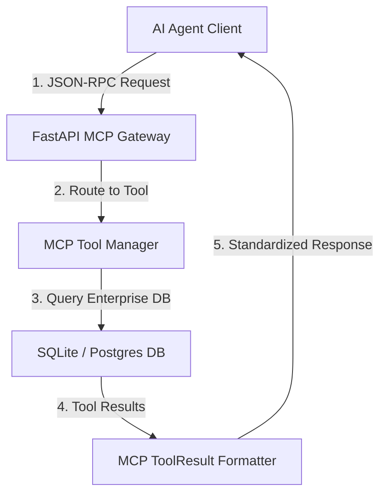

### Component Flow
1. **Client Request**: Agent sends a `call_tool` request (e.g., `get_customer_data`) via HTTP/SSE.
2. **Protocol Parsing**: Gateway parses and validates the JSON-RPC 2.0 message.
3. **Execution**: Server executes the corresponding Python tool function with parameter validation.
4. **Response**: Data is formatted as a standardized MCP `ToolResult` and returned to the agent.

---

## 2. Agent-to-Agent Communication (A2A)
**Goal:** Enable autonomous coordination between specialized agents using an Event-Driven architecture.

### Architecture
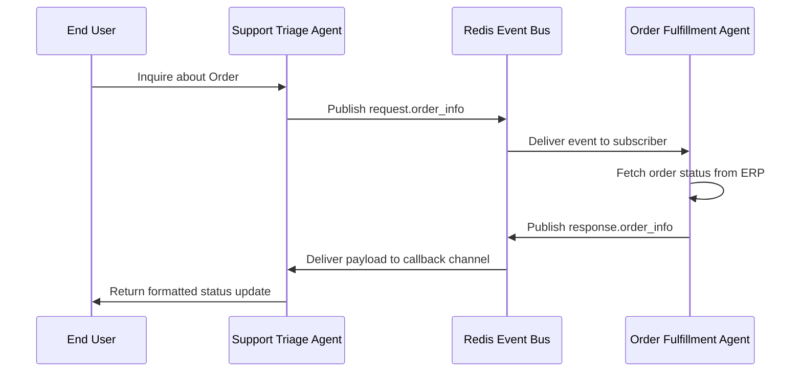

### Component Flow
1. **Event Trigger**: Source agent publishes a task/query to a Redis channel.
2. **Routing**: The message broker (Redis Pub/Sub) distributes the event to subscribed agents.
3. **Async Processing**: Target agent (`OrderAgent`) wakes up, processes the payload, and performs the task.
4. **Callback**: The result is published back to a response channel, allowing the original agent to proceed.

---

## 3. LangGraph Orchestrator
**Goal:** Build complex, stateful multi-agent workflows with cyclic loops and conditional routing.

### Architecture
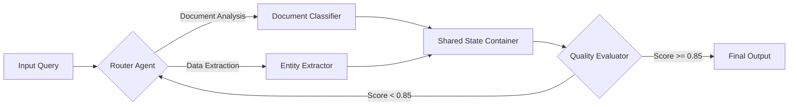

### Component Flow
1. **State Initialization**: A global `StateDict` is created with input data.
2. **Node Execution**: The graph executes nodes (Agents) based on current state.
3. **Conditional Edges**: Logic determines next step (e.g., "If confidence < 0.85, retry").
4. **Conclusion**: Workflow terminates when the `END` node is reached, returning final state.

---

## 4. Production RAG System
**Goal:** Enterprise-grade Retrieval-Augmented Generation with document ingestion and vector search.

### Architecture
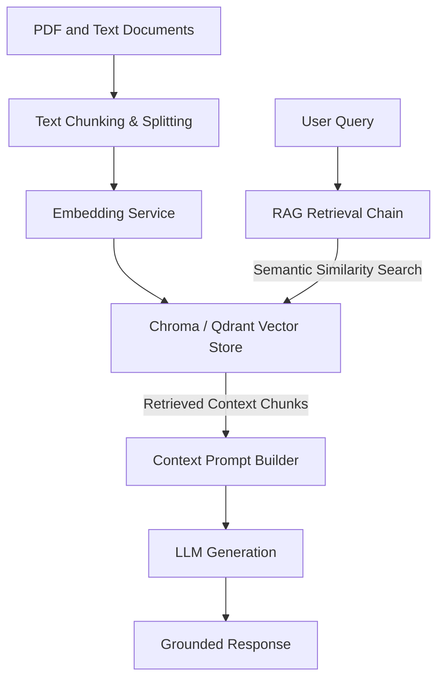

### Component Flow
1. **Ingestion**: Documents are chunked, embedded, and stored in a Vector DB.
2. **Retrieval**: User query is embedded; DB finds most similar chunks (Cosine Similarity).
3. **Synthesis**: Retrieved chunks + Query are fed into the LLM context window.
4. **Generation**: LLM generates a grounded response citing the source chunks.

---

## 5. Autonomous ReAct Agent
**Goal:** An agent capable of planning and executing multi-step goals using tools (ReAct Pattern).

### Architecture
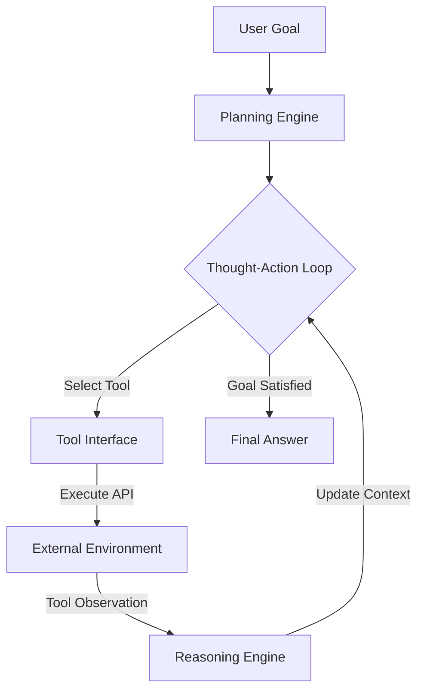

### Component Flow
1. **Plan**: Agent decomposes the user's high-level goal into steps.
2. **Action**: Agent selects a tool (Search, Calculator, API) to solve the current step.
3. **Observation**: Tool output is fed back into the agent's context.
4. **Refinement**: Agent iterates until the goal is satisfied.

---

## 6. Advanced Prompt Engineering Lab
**Goal:** Framework for managing, optimizing, and evaluating complex prompt strategies.

### Architecture
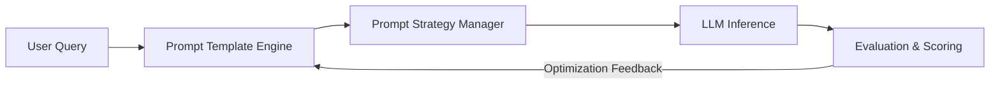

### Component Flow
1. **Templating**: Dynamic construction of prompts using Jinja2/f-strings.
2. **Strategy Selection**: Applying Zero-shot, Few-shot, or Chain-of-Thought patterns based on task.
3. **Evaluation**: Comparing outputs against a baseline to refine prompt phrasing.

---

## 7. LLMOps Pipeline
**Goal:** Automate the lifecycle of LLM applications including testing, deployment, and monitoring.

### Architecture
```mermaid
graph TD
    Code["Git Push"] --> CI["GitHub Actions Runner"]
    CI --> Lint["Ruff Lint & Type Check"]
    Lint --> Security["Bandit & Gitleaks Scan"]
    Security --> Pytest["Unit Tests (>85% Gate)"]
    Pytest --> Ragas["RAGAS Eval Benchmark"]
    Ragas -->|Pass (>=0.85)| CD["Deploy Canary Pods"]
    CD --> Prod["Production EKS Cluster"]
```

### Component Flow
1. **Commit**: Developer pushes code/prompt changes.
2. **CI Trigger**: GitHub Actions runs unit tests and LLM evaluations (Ragas).
3. **Gate**: Pipeline stops if accuracy drops below threshold.
4. **Deployment**: Successful builds are deployed to the production environment.

---

## 8. Vector Database Engine
**Goal:** Scalable storage and retrieval of high-dimensional embeddings.

### Architecture
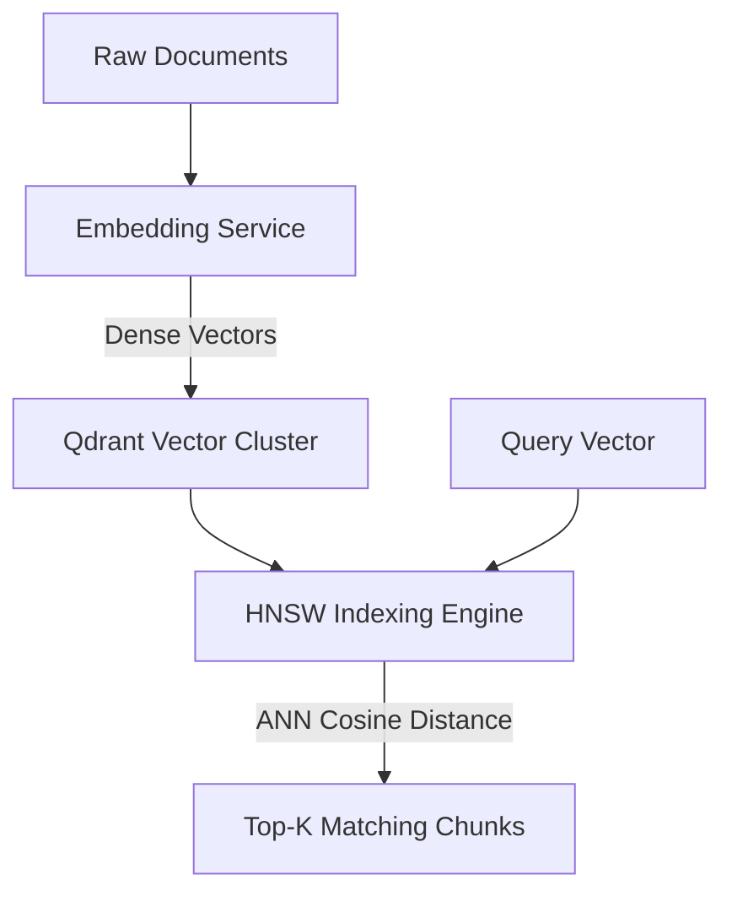

### Component Flow
1. **Embedding**: Converting text/images into vector representations.
2. **Indexing**: Creating HNSW (Hierarchical Navigable Small World) graphs for fast search.
3. **Querying**: Performing Approximate Nearest Neighbor (ANN) search to find matches in milliseconds.

---

## 9. Hybrid Search System
**Goal:** Combine semantic understanding (Dense Retrieval) with keyword matching (Sparse Retrieval).

### Architecture
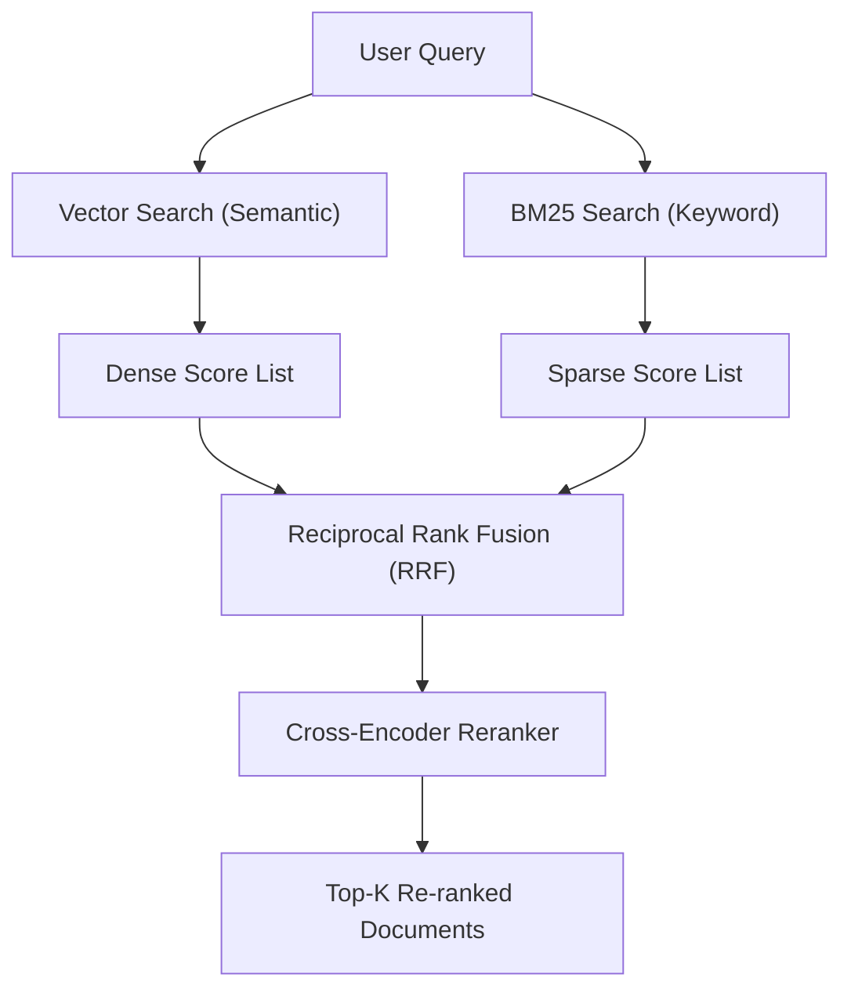

### Component Flow
1. **Dual Retrieval**: Query is processed by both Vector DB and keyword engine (e.g., BM25).
2. **Normalization**: Scores from both systems are normalized (0-1).
3. **Fusion**: RRF algorithm combines lists to prioritize documents found by both methods.

---

## 10. AI Guardrails Gateway
**Goal:** Ensure safety, compliance, and quality control on Model Inputs and Outputs.

### Architecture
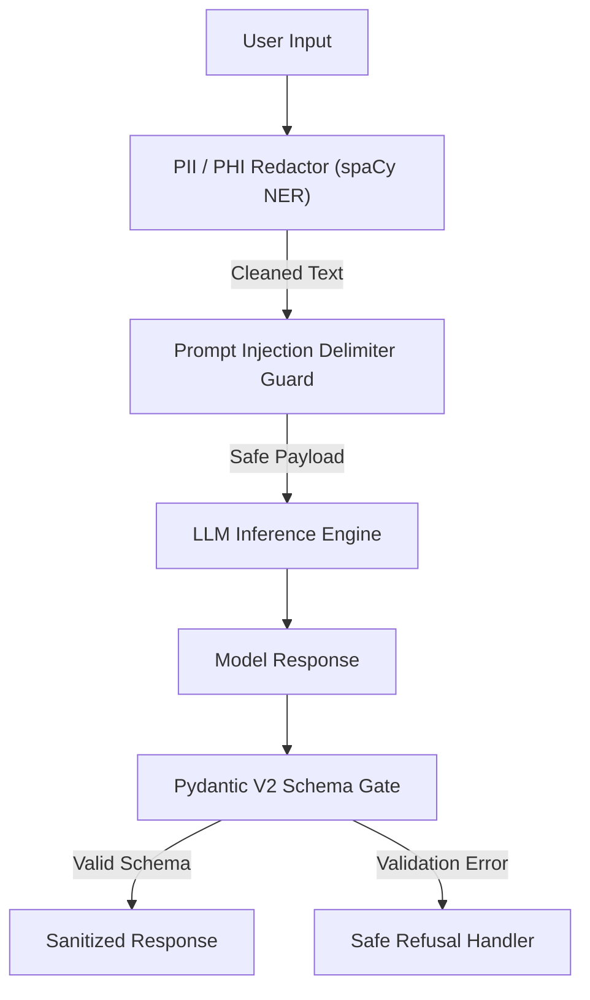

### Component Flow
1. **Input Rails**: Check for PII, toxic content, or forbidden topics before hitting the LLM.
2. **Generation**: LLM produces a draft response.
3. **Output Rails**: Verify response for hallucinations or policy violations (e.g., "Don't give financial advice").
4. **Action**: Block, redacted, or deliver the message.

---

## 11. Enterprise API Gateway
**Goal:** Unified API Gateway pattern to abstract diverse enterprise backends (Salesforce, ServiceNow, Slack).

### Architecture
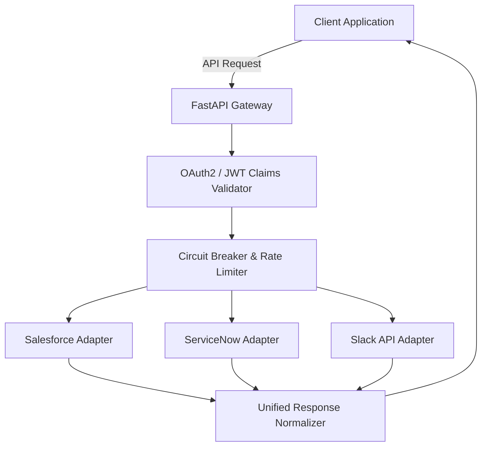

### Component Flow
1. **Request**: Client sends a unified request (e.g., "Create Ticket").
2. **Auth**: Gateway verifies OAuth token.
3. **Routing**: Request routed to the specific backend adapter (ServiceNow).
4. **Resilience**: Circuit breaker wraps the call; retries on failure.
5. **Normalization**: Response transformed into a standard schema before returning.

---

## 12. Responsible AI & Explainability
**Goal:** Framework for fairness, bias detection, and explainability in model decisions.

### Architecture
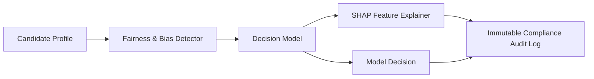

### Component Flow
1. **Pre-processing**: Analyze training data for disparate impact (e.g., Gender bias).
2. **Inference**: Model makes a prediction (e.g., "Hire Candidate").
3. **Explainability**: SHAP values are calculated to explain *why* (e.g., "Experience +5").
4. **Auditing**: Decision and explanation are logged for compliance.

---

## 13. RAGAS Quality Evaluation Pipeline
**Goal:** Automated quality assurance using RAGAS metrics (Faithfulness, Answer Relevance).

### Architecture
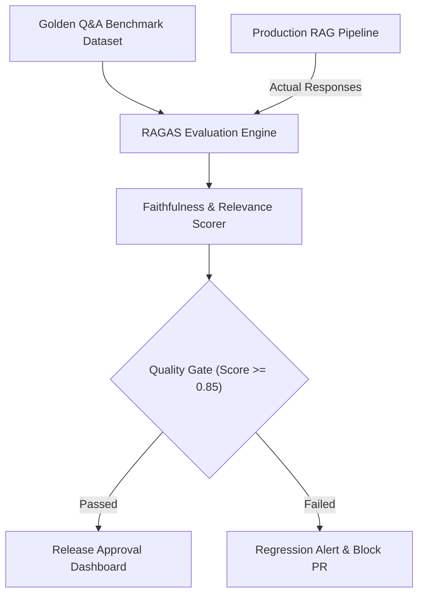

### Component Flow
1. **Test Generation**: Load a "Golden Dataset" of questions and expected answers.
2. **Batch Inference**: Run the RAG system against the dataset to get actual answers.
3. **Scoring**: Use LLM-as-a-Judge (RAGAS) to score Faithfulness and Relevance.
4. **Reporting**: Generate an HTML report highlighting failing cases.

---

## 14. Cost Optimization & Semantic Caching
**Goal:** Reduce inference costs via Two-Tier Caching and Cascading Model Routing.

### Architecture
```mermaid
graph TD
    InboundQuery["User Query"] --> Cache{"Tier-1: Redis Semantic Cache"}
    Cache -->|Cache Hit (>0.92 Sim)| ReturnCached["Return Cached Response (<15ms, $0)"]
    Cache -->|Cache Miss| Router{"Tier-2: Cascading Model Router"}
    Router -->|Simple Query| SmallModel["Gemini 1.5 Flash / GPT-4o-mini"]
    Router -->|Complex Query| LargeModel["Claude 3.5 Sonnet / GPT-4o"]
    SmallModel --> Tracker["Cost Tracker & Cache Updater"]
    LargeModel --> Tracker
    Tracker --> UserResponse["Client Response"]
```

### Component Flow
1. **Check Cache**: Compute embedding of query; check for similar past queries.
2. **Cache Hit**: Return stored response immediately ($0 cost).
3. **Cache Miss**: Router analyzes query complexity.
4. **Inference**: Route to cheapest capable model.
5. **Update**: Log cost and update cache with new Q&A pair.

---

## 15. Dynamic Model Routing
**Goal:** Dynamically select the optimal LLM based on task complexity and context length.

### Architecture
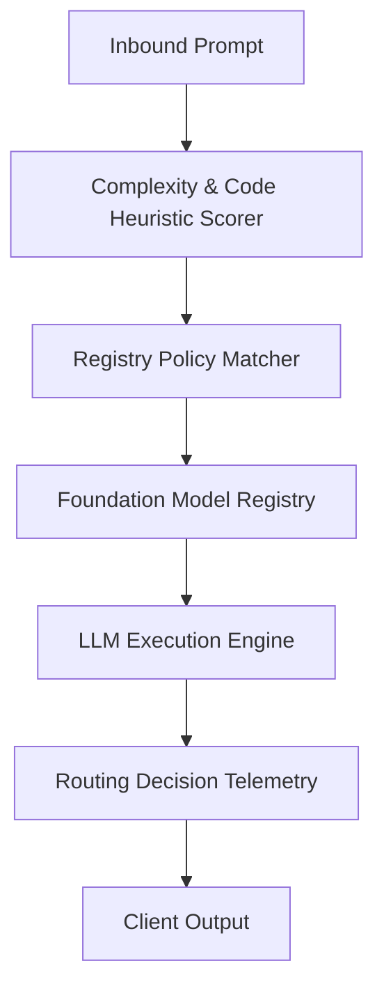

### Component Flow
1. **Analysis**: Scorer detects code, math, or long context in the query.
2. **Matching**: Router checks Model Registry capabilities (e.g., "Needs 100k context").
3. **Selection**: Picks the cheapest model that satisfies requirements.
4. **Logging**: Records specific routing decision for future tuning.

---

## 16. Human-in-the-Loop (HITL) Workflow
**Goal:** Human oversight and verification for high-stakes agent actions.

### Architecture
```mermaid
graph TD
    AgentProposal["Agent Action Proposal"] --> RiskEngine{"Risk Threshold Policy"}
    RiskEngine -->|Low Risk (Auto)| ExecutionNode["Execute Production Mutation"]
    RiskEngine -->|High Risk (Escalate)| EscalationQueue["Manager Approval Queue"]
    EscalationQueue --> HumanReviewer["Human Approver / Manager"]
    HumanReviewer -->|Approved| ExecutionNode
    HumanReviewer -->|Rejected| AbortNode["Abort Action & Log Audit Trail"]
    ExecutionNode --> Receipt["Transaction Confirmation Receipt"]
```

### Component Flow
1. **Proposal**: Agent proposes an action (e.g., "Transfer $50,000").
2. **Policy Check**: System detects amount > Threshold.
3. **Pause**: Execution suspends; request added to Approval Queue.
4. **Review**: Human manager approves via Dashboard/API.
5. **Resume**: Agent creates transaction receipt or aborts.

---

## 17. GraphRAG Knowledge Graph
**Goal:** GraphRAG for structured reasoning and multi-hop relationship traversal.

### Architecture
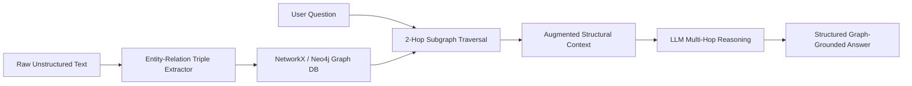

### Component Flow
1. **Ingestion**: Text is parsed into Subject-Verb-Object triples.
2. **Storage**: Entities and relationships stored in Graph DB.
3. **Retrieval**: Query entities mapped to graph nodes; 2-hop traversal fetches context.
4. **Reasoning**: LLM answers using the structural relationships found.

---

## 18. Event-Driven Agentic Architecture
**Goal:** Reactive agents capable of asynchronous processing via Message Bus.

### Architecture
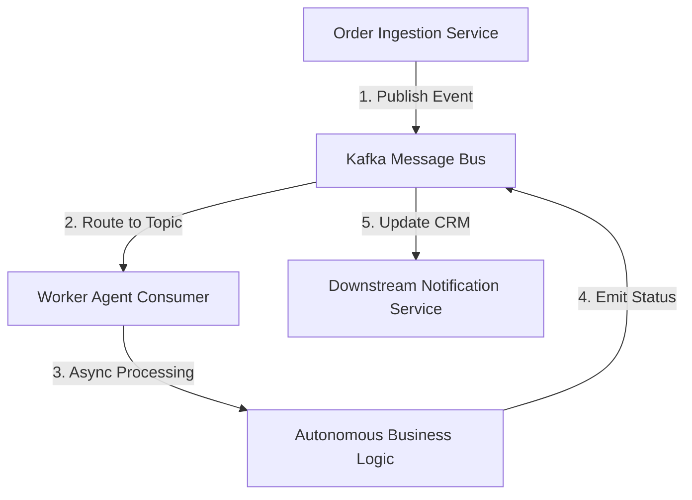

### Component Flow
1. **Event**: External system publishes `order.created`.
2. **Consumption**: Agent subscribes to topic and picks up message.
3. **Processing**: Agent validates order (Async/Non-blocking).
4. **Reaction**: Agent publishes `inventory.check` event for downstream services.

---

## 19. Full-Stack Observability & Tracing
**Goal:** Full operational visibility into agent operations (Logs, Metrics, Traces).

### Architecture
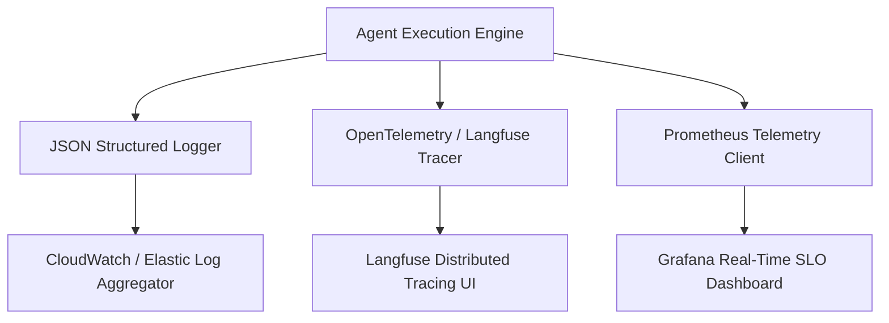

### Component Flow
1. **Instrumentation**: Agent code wrapped with Tracing spans and Metric counters.
2. **Execution**: Every request increments counters and logs JSON events.
3. **Scraping**: Prometheus scrapes `/metrics` endpoint.
4. **Analysis**: Dashboards visualize error rates, P99 latency, and token usage.

---

## 20. Cloud Infrastructure Deployment
**Goal:** Production-grade deployment on AWS EKS with Infrastructure-as-Code (Terraform).

### Architecture
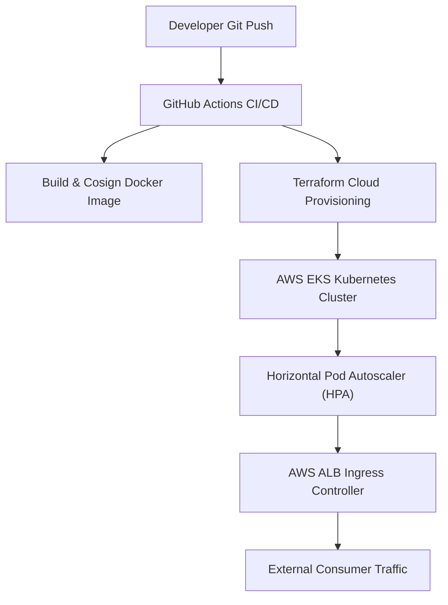

### Component Flow
1. **Build**: Docker container created from Source.
2. **Provision**: Terraform brings up VPC and EKS Cluster.
3. **Deploy**: Kubernetes manifests apply Deployment, Service, and HPA.
4. **Run**: Pods start, health checks pass, LoadBalancer exposes IP.
